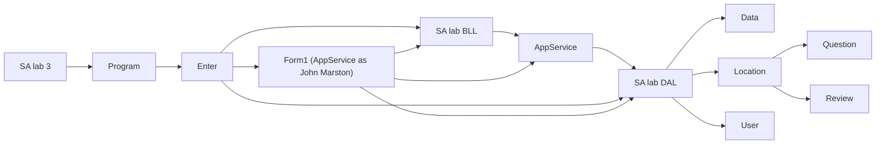

```mermaid
flowchart LR
Sa["SA lab 3"]
Pr["Program"]
Sa-->Pr
BLL["SA lab BLL"]
As["AppService"]
BLL-->As
DAL["SA lab DAL"]
Dat["Data"]
DAL-->Dat
Loc["Location"]
DAL-->Loc
Qs["Question"]
Loc-->Qs
Rew["Review"]
Loc-->Rew
Us["User"]
DAL-->Us
As-->DAL
Et["Enter"]
Et-->BLL
Et-->DAL
Pr-->Et
F1["Form1 (AppService as John Marston)"]
Et-->F1
F1-->DAL
F1-->BLL
F1-->As

```

---
